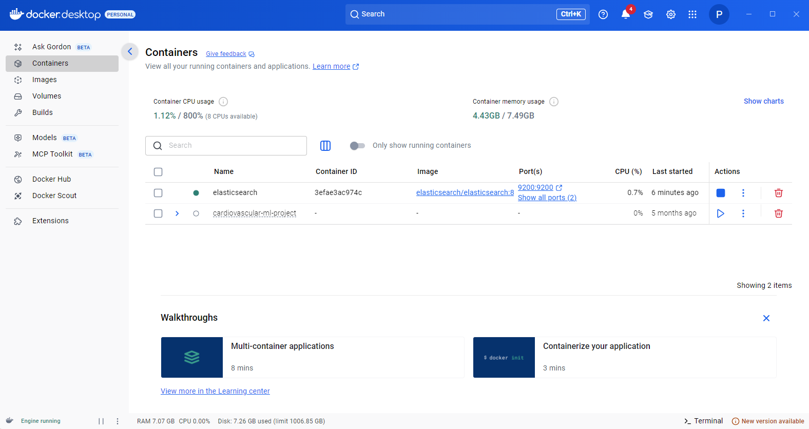
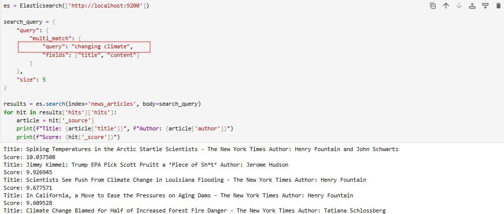

# News Search Engine with MongoDB and Elasticsearch

## Overview

This project is a full-text search engine built for exploring news articles at scale. The system uses MongoDB Atlas as the primary document store for over 50,000 news articles, while Elasticsearch provides fast search capabilities for around 12,000 indexed articles.

## The Dataset

This project was built using a comprehensive news articles dataset containing over 50,000 articles from major publications including The New York Times, Breitbart, and other prominent sources. Each article in the dataset includes structured fields: a unique identifier, title, full content text, author name, publication name, publication date (broken down into date, year, and month fields), and the original URL. The dataset comes from publicly available news article collection and has articles with missing values, inconsistent formatting, and varying content lengths.
Kaggle Sources: https://www.kaggle.com/datasets/asad1m9a9h6mood/news-articles?select=Articles.csv

## Building MongoDB Database 


The first step in the project was establishing a reliable data storage layer using MongoDB Atlas. MongoDB was chosen because it handles semi-structured document data naturally, making it ideal for articles that might vary in their field completeness or structure. Setting up MongoDB Atlas involved creating a free-tier cluster, configuring network access to allow connections from my development environment, and establishing a database user with appropriate permissions.

I loaded the CSV dataset into MongoDB using Python's pandas library to read the file and pymongo to handle the database operations. The process converted each row of the CSV into a JSON-like document that MongoDB stores in BSON format. All 50,000 articles were inserted into a collection called "articles" within a database named "news_db". The data was then accessible through MongoDB Compass, MongoDB's GUI tool. Each document contains the fields from the CSV: unique identifier, author, publication, date, title, content text. 

## Integrating Elasticsearch



The next phase involved setting up Elasticsearch to enable sophisticated search capabilities. Elasticsearch specializes in full-text search with features like relevance scoring, fuzzy matching, and complex text analysis. I deployed Elasticsearch locally using Docker, which provided an isolated, reproducible environment.

The integration between MongoDB and Elasticsearch required building an ETL pipeline. This pipeline reads documents from MongoDB, cleans the data to handle edge cases like NaN values that would cause Elasticsearch to reject the documents, and then indexes each article into Elasticsearch. The indexing process analyzes the text content, breaking it down into searchable tokens and building inverted indexes that make searches faster. I indexed approximately 12,000 articles, which took around 10-15 minutes as each article's title and content were processed and stored.

## Search Functionality and Results



With both databases the system performs sophisticated searches across the 12k articles quickly. Elasticsearch uses the BM25 algorithm for relevance scoring, which considers how frequently search terms appear in a document, how rare those terms are across the entire collection, and other factors to rank results. When searching for "changing climate," the system found 2,645 matching articles and returned the most relevant ones first. The top result, scoring 10.03, was an article titled "Spiking Temperatures in the Artic Statrtle Scientists", which does not cotain any of the words in the searchy query, but is obviously relevant.

The system can search across both article titles and content, with titles weighted more heavily since they're typically more indicative of an article's main topic. You can also combine text search with filters, such as limiting results to specific publications, date ranges, or authors. The multi-match query structure allows for flexible searching where terms don't need to appear in exact order, and Elasticsearch's text analysis handles variations in word forms automatically. Every search completes in well under 100 milliseconds, demonstrating how Elasticsearch's specialized architecture outperforms general-purpose databases for search-heavy workloads.

## Technical Implementation

The entire project is implemented in Python, leveraging several key libraries. The pymongo library provides the interface to MongoDB, handling connection management and CRUD operations. The elasticsearch Python client communicates with the Elasticsearch API, translating Python dictionaries into the JSON queries that Elasticsearch expects. Pandas facilitated the initial data loading from CSV format. The data cleaning logic handles edge cases like NaN values that appear in the dataset where information is missing—converting these to empty strings prevents Elasticsearch from rejecting documents during indexing.

## Technologies Used

- **Python 3.x** - Primary programming language for all scripts and data processing
- **MongoDB Atlas** - Cloud-hosted NoSQL document database for article storage
- **Elasticsearch 8.11** - Search and analytics engine deployed via Docker
- **Docker Desktop** - Container platform for running Elasticsearch locally
- **pymongo** - Official MongoDB driver for Python
- **elasticsearch** - Official Elasticsearch client library for Python
- **pandas** - Data manipulation library used for CSV processing

## Setup Requirements

To run this project locally, you'll need Python 3.x installed along with the following Python packages:
```txt
pymongo==4.6.1
elasticsearch==8.11.1
pandas==2.1.4
